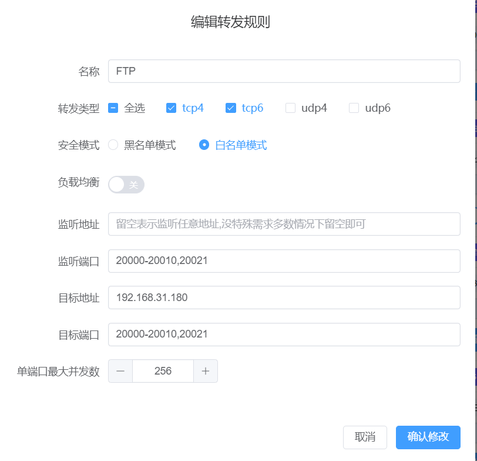
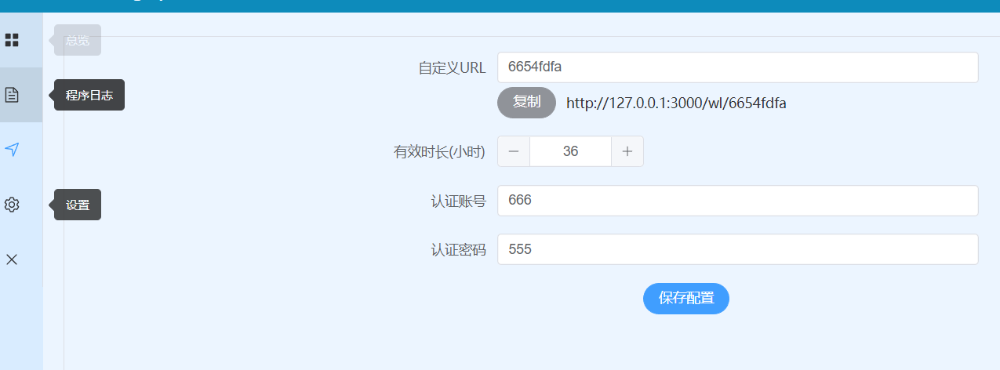
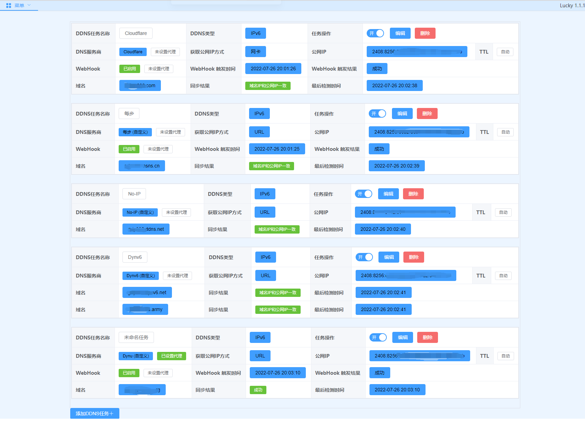
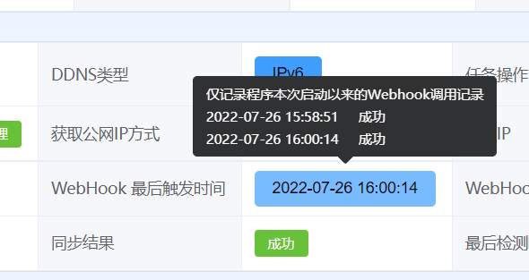
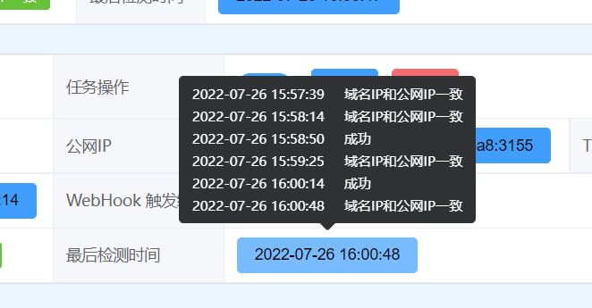
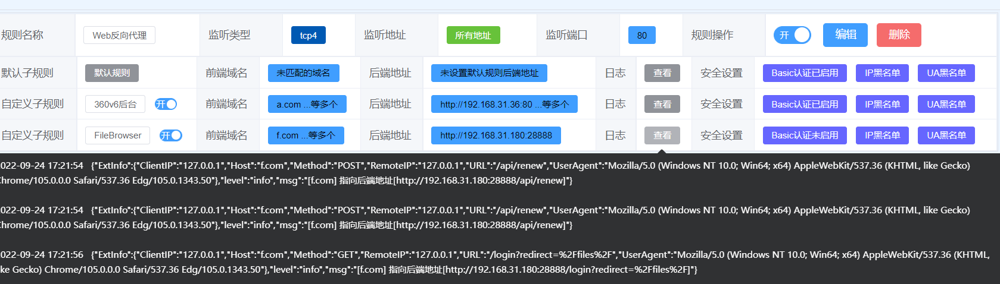
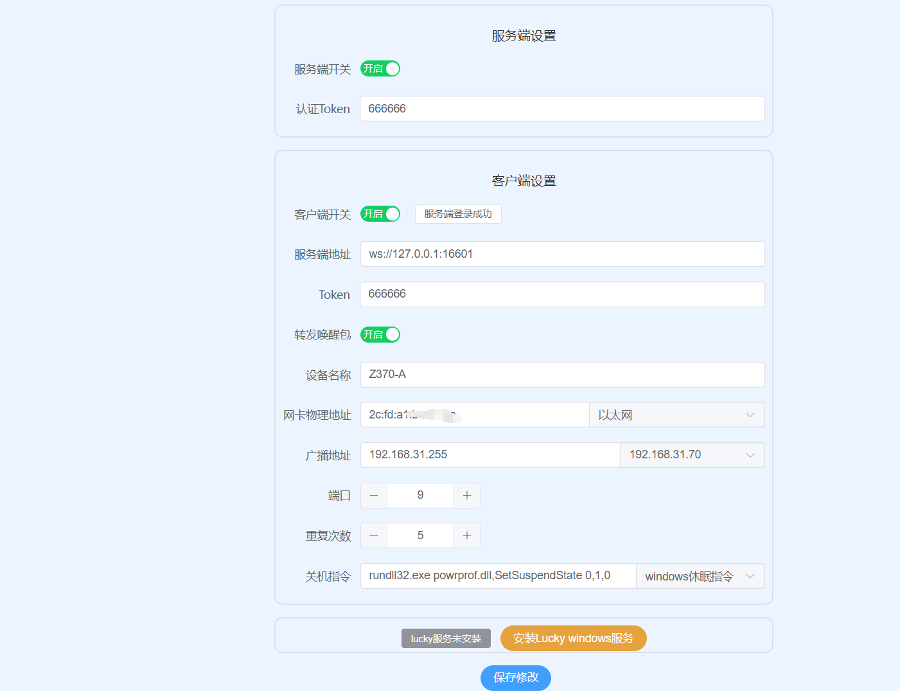

# Lucky(万吉)
 

 ## 注意：源码公布到1.4.10版本，后续暂无继续开源计划。

 ## 麻烦各位大佬发表lucky相关教程的时候不要加上“开源”神器，开源二字我不配，lucky后续也没开源打算。
        1.开源并不等于安全，闭源并不等于不安全。闭源软件开发也会受到安全人员的审查。无论是开源还是闭源软件，都有可能会受到各种安全人员的审查和研究。安全人员可以使用各种技术手段来检测软件的安全性和漏洞。
        2. 个人观点lucky这种应用类软件更多只是体力活，毫无技术含量，开源的优势在于透明度和社区参与，更多劳动力参与，但也可能导致功能过多、复杂度增加的问题。闭源软件的优势在于我想怎么写就怎么写,即使还未能从lucky中获利，lucky对我也有更深的特殊含义。
        3. 我对lucky的规划还有一大部分未实现，不想被人当免费劳动力使唤，不解释太多，就这样。

 
 ## 如果您是第一次使用Lucky，请务必先访问 https://lucky666.cn ，并仔细阅读相关的文档，以获得必要的信息和答案。在这些文档中，您可以了解到Lucky的基本功能和特性，掌握Lucky的使用方法，以及解决常见的问题和疑惑。
 

<!-- TOC -->
- [Lucky(万吉)](#)
  - [特性](#特性)
  - [一键安装](#一键安装)
  - [OpenwrtIPK包安装](#OpenwrtIPK包安装)
  - [使用](#使用)
  - [Docker中使用](#docker中使用)
  - [后台界面](#后台界面)

  - [开发编译](#开发编译)
  - [更新日志](#更新日志)
  - [使用注意与常见问题](#使用注意与常见问题)

<!-- /TOC -->


## 特性

Lucky最初是作为一个小工具，由开发者为自己的个人使用而开发，用于替代socat，在小米路由AX6000官方系统上实现公网IPv6转内网IPv4的功能。Lucky的设计始终致力于让更多的Linux嵌入式设备运行，以实现或集成个人用户常用功能，降低用户的硬件和软件操作学习成本，同时引导使用者注意网络安全。随着版本更新和网友反馈，Lucky不断迭代改进，拥有更多功能和更好的性能，成为用户值得信赖的工具。

Lucky 的核心程序完全采用 Golang 实现，具有高效、稳定、跨平台等优点。其后台前端则采用 Vue3.2 技术进行开发，具有良好的用户体验和响应速度。此外，Lucky 的管理后台采用前后端分离的架构，第三方开发者也可以自由使用OpenToken轻松调用Lucky的各种功能接口。


## 功能模块

目前已经实现/集成的主要功能模块有
  - 端口转发
  - 动态域名(DDNS)
  - Web服务
  - Stun内网穿透
  - 网络唤醒
  - 计划任务
  - ACME自动证书
  - 网络存储


### 端口转发
  1. 主要用于实现公网 IPv6 转内网 IPv4 的 TCP/UDP 端口转发。
  2. 支持界面化的管理转发规则，用户可以通过 web 后台轻松地进行规则的添加、删除、修改等操作。
  3. 单条转发规则支持设置多个转发端口，这样可以实现多个内网服务端口的转发。
  4. 提供了一键开关和定时开关功能，用户可以根据自己的需求设置转发规则的开启和关闭时间，还可以使用计划任务模块进行定时开关。
  5. 单条规则支持黑白名单安全模式切换，用户可以根据需要选择使用白名单模式或黑名单模式。
  6. 白名单模式可以让没有安全验证的内网服务端口稍微安全一点暴露到公网，提高服务可用性。
  7. 实时记录最新的访问日志，方便用户了解转发情况。
  8. 规则列表日志一目了然，用户可以方便地追踪转发异常，及时进行排查和处理。


### 动态域名(DDNS)
  1. 支持接入多个不同的 DNS 服务商。
  2. 支持全功能自定义回调（Callback），包括设置 BasicAuth，方便接入任意 DNS 服务商。
  3. Webhook 支持自定义 headers。
  4. 内置常用免费 DNS 服务商设置模板（每步、No-IP、Dynv6、Dynu），通过自定义回调进行快速接入，仅需修改相应用户密码或 token 即可一键填充。
  5. 支持 阿里云，百度云，华为云，京东云，腾讯云，火山引擎，帝恩爱斯-DNS.LA,Cloudflare，deSEC,DNSPod.CN，DNSPod.COM，Dynadot，Dynv6，Freemyip ,GoDaddy，Name.com，NameSilo,Porkbun，Vercel等服务商。


### Web服务
  1. 支持反向代理、重定向和 URL 跳转。
  2. 支持 HTTP 基本认证。
  3. 支持 IP 黑白名单模式。
  4. 支持 UserAgent 黑白名单。
  5. 规则日志清晰易懂，便于追踪异常。
  6. 支持一键开关规则和定时开关规则。


### Stun内网穿透
  1. 实现内网穿透，无需公网IPv4地址。
  2. 适合于国内运营商级NAT1宽带网络. 

### 网络唤醒
  1. 支持远程控制唤醒和关机操作
  2. 支持接入第三方物联网平台(点灯科技 巴法云),可通过各大平台的语音助手控制设备唤醒和关机.

### 计划任务
  1. 不依赖 Linux 系统的 Cron，支持 Windows 系统。
  2. 操作简便，可视化编辑。
  3. 可操作控制 Lucky 框架内的其他模块开关。

###  ACME自动证书
  1. 支持 ACME 自动证书的申请和续签。
  2. 支持 阿里云，百度云，华为云，京东云，腾讯云，火山引擎，帝恩爱斯-DNS.LA,Cloudflare，deSEC,DNSPod.CN，DNSPod.COM，Dynadot，Dynv6，Freemyip ,GoDaddy，Name.com，NameSilo,Porkbun，Vercel等服务商.


### 网络存储
  1. 网络存储模块是一个应用范围广泛的模块，它提供了将本地存储、WebDAV和阿里云盘挂载到Lucky内部的各个文件类服务功能。
  2. 通过网络存储模块，你可以将添加的存储挂载到Web服务的文件服务、WebDAV、FTP和FileBrowser模块，实现更加便捷的文件管理和访问。


## 一键安装

- [一键安装详看这里](https://github.com/gdy666/lucky-files)


## OpenwrtIPK包安装

- [Openwrt IPK包](https://github.com/gdy666/luci-app-lucky)


## 使用
    

- 默认后台管理地址 http://<运行设备IP>:16601
  默认登录账号: 666
  默认登录密码: 666

- 常规使用请用 -cd <配置文件夹路径> 指定配置文件夹的方式运行 
    ```bash
    #仅指定配置文件夹路径(如果配置文件夹不存在会自动创建),建议使用绝对路径
    lucky -cd luckyconf

    ```


## Docker中使用

- 不挂载主机目录, 删除容器同时会删除配置

  ```bash
  # host模式, 同时支持IPv4/IPv6, Liunx系统推荐
  docker run -d --name lucky --restart=always --net=host gdy666/lucky
  # 桥接模式, 只支持IPv4, Mac/Windows推荐,windows 不推荐使用docker版本
  docker run -d --name lucky --restart=always -p 16601:16601 gdy666/lucky
  ```

- 在浏览器中打开`http://主机IP:16601`，修改你的配置，成功
- [可选] 挂载主机目录, 删除容器后配置不会丢失。可替换 `/root/luckyconf` 为主机目录, 配置文件夹为lucky

  ```bash
  docker run -d --name lucky --restart=always --net=host -v /root/luckyconf:/goodluck gdy666/lucky
  ```


## 宝塔Docker安装

1.  安装宝塔面板 (9.2.0版本及以上)，前往 [宝塔面板](https://www.bt.cn/new/download.html) 官网，选择正式版的脚本下载安装
2.  安装后登录宝塔面板，在菜单栏中点击 Docker ，首次进入会提示安装 Docker 服务，点击立即安装，按提示完成安装
3.  安装完成后在应用商店中找到 lucky ，点击安装，配置基本选项 即可完成安装


## 后台界面




#### 动态域名服务








#### Http反向代理


#### 网络唤醒





#开发编译


    ```bash
    go build -v -tags "adminweb nomsgpack" -ldflags="-s -w"
    ```


# 更新日志

    2025-06-03 v2.17.8
      优化：网速趋势曲线现支持 Mbps 与 MB/s 双单位同步显示，方便同时查看网络带宽及传输速度。

    2025-06-03 v2.17.8beta 
      1. 动态域名
      修复同步 dynv6 的 CNAME、SRV、MX 记录的已知问题。请先在 dynv6 平台删除原有对接记录，再重新执行同步操作。
      2. 存储管理
      存储管理功能已停止维护，阿里云盘及 WebDAV 存储功能停用，请勿再使用。如需设定本地路径，请直接在 FTP、WebDAV、FileBrowser 等文件服务中配置。
      3.Web服务
      新增“禁用连接复用”开关。如 OpenWrt 后台反向代理出现 "Unsolicited response received on idle HTTP channel starting with '0\r\n\r\n'" 错误，请在该子规则的定制模式-网络设置中启用此开关。为提升反向代理性能，其他规则通常无需开启。
      4. WebDAV服务
      通过 RaiDrive 挂载分区时支持显示真实可用空间。
      5. FileBrowser功能修复
      修复 FileBrowser 用户自助注册功能。

    2025-05-31 v2.17.7 beta
      1. 修复证书路径导入时，由于证书域名顺序不一致导致的证书刷新失败问题。
      2. 修复对接点灯服务器时，点灯无法连接导致的协程泄漏等问题。
      3. 更新对接点灯服务器时的 User-Agent 为 “Lucky-Client/lucky666.cn”，以解决前面版本无法连接点灯服务器的问题。如该 User-Agent 被点灯服务器拉黑，与点灯对接功能将永久取消。
      4. 优化系统资源统计相关代码，改进 Lucky 总览页面，新增 CPU 使用率、实时网速曲线图与进程当前打开句柄数展示。
      5. 设置页面新增“指定监测网卡”功能，支持用户自定义监测的网卡。

    2025-05-25 v2.17.6 
        1.STUN模块
          新增 NAT 类型检测功能。
        2.脚本执行
          修复 #! 首行判断错误，确保脚本正确调用 Bash 执行。
        3.DDNS
          修复部分情况下 IPv6 地址无法通过 odhcpv6 获取的问题。
        4.Web服务
          4.1 优化统计组件细节，当子规则 Coraza 未启用时不显示统计数据。
          4.2 主规则安全模式改为在 TCP 层处理，实现四层安全检测。被拦截连接直接断开，不再返回 403，提升检测效率。
          4.3 增加全局认证配置，子规则可指定继承统一认证，无需单独重复设置，实现统一管理。
          4.4 支持设置单个 IP 的 Coraza 拦截次数上限，超限后自动拉黑（功能即将开放）
        5.Coraza
          5.1 内置规则集升级至 4.14。
        6.全局设置
          6.1 新增支持自定义选择系统默认内置 DNS 解析器（选项：default）。
          6.2 新增全局无限制 CIDR 列表，列表内地址将不受所有 Web 服务速率与连接数限制（功能即将开放）。
          6.3 OpenToken安全，若验证失败超过 66 次，将自动禁用 OpenToken 并提示需重启 Lucky，同时提醒用户修改安全入口。
        7. IP信息查询
          查询性能进一步优化。
        8. 修复已知bug和其它细节及性能优化
        9.Docker版本
          预装 curl 工具包，方便容器内进行网络相关操作。

    2025-05-11 v2.17.5 beta
        1. 修复：解决上个 beta 版本因压缩错误导致无法在 Linux 系统下运行的问题。
        2. 新增：Web 服务支持 HomeBox 内网测速后端服务类型，可与 HomeBox 修改版前端配合使用。
            GitHub 地址：https://github.com/gdy666/homebox
            推荐使用 http 协议进行内网测速。
            如不想自建前端，可直接使用以下测速页面：
            http://speedtest.66666.host/
            https://speedtest.66666.host/
            请在高级配置中填写你在 Lucky 中设置的内网测速地址。

    2025-05-11 v2.17.4 Beta 
      优化：计划任务模块，提升IP查询性能。
      修复：Web服务中，标记子规则时默认规则未正确隐藏的问题。
      新增：Web服务支持Proxy Protocol协议自动识别。请前往Lucky设置页面，在“全局代理协议信任的CIDR列表”中添加本地直接访问IP（如127.0.0.1）以启用。
   
    2025-05-09 v2.17.3
        修复在特殊 Docker 多版本 Lucky 环境下，或频繁升降级 Lucky 版本时，因配置参数丢失导致 DDNS 持续无间断检测，从而引发 CPU 占用过高的问题。
        2.17.2 版本使用正常的用户可忽略本次更新。如遇 CPU 占用过高，亦可通过编辑并保存一次 DDNS 任务恢复正常。

    2025-05-08 v2.17.2
        1. 优化了 Docker 环境的适配，提升了后台通过 Lucky 进行上传升级的成功率。
        2. 修复了 DDNS 功能：解决部分接口未返回 IP 导致协程崩溃的问题，增强了系统稳定性。
        3. 前端细节优化。
  
    2025-05-06 v2.17.1
      DDNS
      - 修复上个版本已知的相关 bug。
      IP地址库
      - 修复纯真IP库和ZX IPv6使用错误类型文件时，导致Lucky程序异常退出的问题。
      Web服务
      - 优化前端显示效果。

    2025-05-04 v2.17.0 
      DDNS：
        修复自定义 Callback 查询时缓存失效的问题。
        Dynv6 主域名 A 记录每次都被强制同步的问题。
        修复 {ipv4Addr}、{ipv6Addr} 变量在某些情况下识别异常，导致错误触发开关的问题。
        优化 httpTimeout 参数范围为 10-60 秒，修正超时过小导致网络请求失败的问题。
        修复自定义 Callback 同时启用 IPv4/IPv6 变量时出现的异常。
        新增网卡支持负数，表示从 IP 列表末尾选择。
        DDNS 工作协程优化，实现单任务单协程。
        新增一键手动触发同步功能。
        优化接口列表的调用策略。
      Web服务：
        新增实时网速显示。
        优化 Nginx 自定义格式的兼容性。
      Coraza：
        内置规则集更新为 OWASP_CRS/4.13.0。
      其它优化与修复：
        优化底层 DNS 查询架构，支持多个 DNS 服务器并发查询。
        添加 DDNS 任务/acme证书时时，自动识别 DNS 托管商（现支持 Cloudflare、Dynv6、华为云、DNSPod 国际版）下账号已存在的多级域名后缀，并自动加入 DDNS 设置中的自定义多级后缀列表。
        3. 修复其它已知 bug。

    2025-04-08 v2.16.1
        1. 修复 2.16.0版本中，申请证书成功后无法保存的问题。
        2. 修正了在lucky启动时，WebDAV和FileBrowser模块防火墙端口放行异常的问题。
        3. 重新支持 Windows 7 和 Windows Server 2008 R2 系统。（没测试）

    2025-04-08 v2.16.0
      后台设置：
        - 新增：增加强制HTTPS访问的开关，HTTP请求将自动重定向到HTTPS。
      Web服务：
        - 新增：文本输出功能支持禁用长连接。
        - 修复：文件服务的跨域开关支持问题。
      ACME（证书管理）：
        - 新增：支持同时申请多个ACME证书。
        - 新增：支持手动中止证书申请。
        - 优化：适配改善freemyip域名证书申请，主域名和泛域名无需分开记录申请。
      其他：
        - 调整：放宽后台API请求频率限制，降低“too many request”错误提示的出现概率。

    2025-03-31 v2.15.9 更新日志
      DDNS：
        新增：全面支持spaceship的10种记录类型（包括A记录、AAAA记录等）
        新增：自动识别常见二级域名后缀（如.ip-ddns.com、.ggff.net等）
        修复：已成功获取IP地址时仍显示错误提示的问题
        修复：域名包含大写字母导致重复生成记录的问题
        修复：从 v2.15 之前版本升级时，二级域名识别异常的问题
        
      ACME：
        新增：支持spaceship证书服务
        新增： 可自由设置 每日证书检查时间 ， 证书到期前多少天自动续期
        优化：ZeroSSL证书申请现在完全自动获取EAB验证信息（无需手动填写）※ 注意：如需在ZeroSSL官网查看证书，请确保注册邮箱填写正确

      IP地址库：
        新增：ipip格式数据库现已支持IPv6地址查询
        修复：个别情况下某个数据库返回空字符串时，现在会自动尝试查询下一个可用数据库

   [更多日志请查看](https://lucky666.cn/docs/category/%E6%9B%B4%E6%96%B0%E6%97%A5%E5%BF%97)


。


